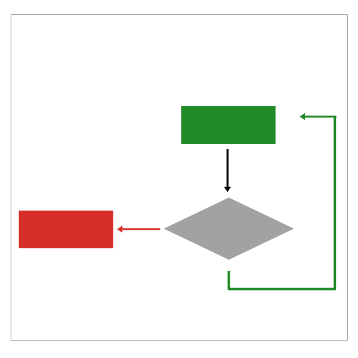

<!-- $theme: gaia -->

<!-- page_number: true -->
<!-- *page_number: false -->
<!-- *template: invert -->

IML 400 Creative Coding for the Web
====
## Arrays, DOM and CSS Shapes
### Meeting 3:    09.08.16

---

## Agenda
1. Lecture
	* Review flow charts
	* JS
		* Conditionals
		* Arrays		
		* Built on JS objects
	* DOM

---

## Agenda
2. Workshop
	* Class landing page hack
	* Sandbox development
		* from console to script 
	* Arrays example???
	* Drawing with CSS + DOM Access


---

#  ```if else```

---

## Flow Diagram Patterns
#### ```if --> else```


---

#### ```if --> else```


---

#### ```if,  else```

``` Javascript
if( /* a boolean statement or expression */ ){ 
// some code if the boolean is true  
} else {
  // some code if the boolean is false
}
```

---

#  ```while```

---

## Flow Diagram Patterns
#### ```while```


---

#### ```while```


---

#### ```while```

``` Javascript
while( /* a boolean statement or expression */ ) { 
// some code if the boolean is true  
} 

//pick up here when the boolean is false
```

---

#  ```for```

---
## Flow Diagram Patterns
#### ```for```


---

#### ```for```


---


#### ```for```

``` Javascript
//for( var counter ; counter <=> limit; counter change){ 
for( var i=10; i > 0; i-- ){ // same as i-- = i = i - 1 
// code to execute while counter is within limits
// javascript will take care of changing the counter
} 
//pick up here when the counter is done
```

---

#  ```do while```

---


## Flow Diagram Patterns
#### ```do --> while```



---
#### ```do --> while```


---

#### ```do --> while```

``` Javascript
do {
	// run this once and then check boolean  
	// keep running if boolean is true
 } while( /* a boolean statement or expression */ ) 
//pick up here when the boolean is false
```

---

#  ```if elseif else```

---

## Flow Diagram Patterns
#### ```if --> else if --> else```


---

#### ```if --> else if --> else```


---
#### ```if --> else if --> else```

```javascript
if( /* a boolean statement or expression */ ){
  // some code if the boolean is true 
} else if(/* a boolean statement or expression */) {
  // some code if this boolean is true 
} else if (.... {
} else {
  // execute if none of the other conditions are met
}

```
---

## Data Types

---

## Data Types

* Boolean
* Null  *(var does not exist)*
* Undefined *(var exists but does not have a value)*
* Number
* String
* Symbol ( new )
* Object

---

## Arrays

An ```Array``` is special type of object that is defined in the Javascript language.  

An ```Array``` is a list.  

What makes it special is that Javascript gives special language keywords (syntax) for doing useful and common tasks with arrays.

---

## Array Example

#### Let's make a grocery list

---

## Eggplant Parmagiana
#### Ingredients
* eggplant
* mozarella
* tomatoes
* garlic
* panko
* salt

---

```javascript
//this can and probably should go on 1 line. I am using  
//multiple lines for presentation purposes only

var groceries = [ 'eggplant',
'mozzarella',
'tomatoes',
'garlic',
'panko',
'salt',
20];
```

how many items are on our list?

``` javascript
console.log(groceries.length)
```

---

how do we access items?

```javascript
console.log( list[0] ); // eggplant
console.log( list[1] ); // mozarella
console.log( list[5] ); // salt

console.log( list[6] ); // ??? 

```

**lists start counting from 0!**  

This means that if you have 10 items the last item can be found at index 9.  

In general: a list of `n` items can be addressed with indices `0 to (n-1)`

---

### Challenge

using the loop patterns that we reviewed earlier:

write code that will print out all of the items on our shopping list...

---

### Ugh, how could we forget!

#### Adding items to the list

we need some herbs and spices for our dish.  

how to add items to a list

```javascript
list.push('italian seasoning');
list.push('salt');
list.push('ketchup');

console.log(list);
```

---

### Americans use too much ketchup

#### Removing items from a list

```javascript
//this will remove the last item on the list
list.pop();

console.log(list);

```
---

### Object Functionality

You have to read the Javascript documentation to learn all of the handy operations that the language provides to you.  

Documentation for [Arrays](https://developer.mozilla.org/en-US/docs/Web/JavaScript/Reference/Global_Objects/Array/push)  

Documentation for [Strings](https://developer.mozilla.org/en-US/docs/Web/JavaScript/Reference/Global_Objects/String)  

Essentially what this tells you is how you can manipulate, access and control Arrays and Strings using Javascript.  

Where it gets interesting is...

---

### Document Object Functionality

When you can start to use this strategy for controlling document content:

Documentation for [HTML Document Objects](https://developer.mozilla.org/en-US/docs/Web/API/Document)
