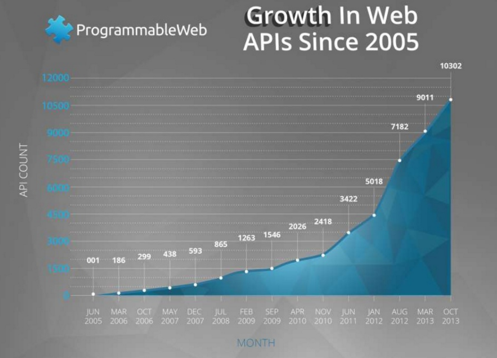

<!-- $theme: gaia -->

<!-- page_number: true -->
<!-- *page_number: false -->
<!-- *template: invert -->

IML 400 Creative Coding for the Web
====
## Programming the Web - APIs
### Meeting 6:    09.29.16

---
## Reminder

* Midterm website is due next week!
	* Homepage is accessible from [here](http://storm.usc.edu/~rspell/iml400)
	* All assignments to date are completed and accessible from somewhere on your site
	* All of your links work

---

* Your site is designed to the best of you ability:
	* good demonstration of layout
	* good color usage  
	* good font choices (legibility, consistency)
	* good UI (we haven't covered this specifically yet, but let your intuition be your guide for now)

<!--
* **BONUS Requirement**  
	* a statement assessing how you are doing so far in the course (are you keeping up, if not what are your struggles. What are _specific_ areas that are unclear. If you are what are you looking forward to getting too.)  -->

---

## Agenda
1. What is an API
2. Steps to getting setup

## Workshop
1. Flickr	

---

<!-- *template: invert -->

## API

---

## What is an API

API's are Applicaiton Programming Interface

In class thus far we have written small programs that consist of a handul of functions.  

Those functions typically take parameters to work.  

If you were to share your program or give instructions for its use you would have to explain what parameters your program accepts in order to generate proper results

---

## What is an API

The set of those parameters is the _interface_ to your application.  

An API is simply a documentation of how to _"interface"_ (i.e. use) a program.  

All programs have interfaces. (e.g. Twitter, Facebook, OS X, Windows)  

You can not interact with all program's interfaces however. Just the one's that the programmer gives you access to.

---

## Why provide API's ?

* internally they are necessary for development teams and documentation
* externally, they allow outside developers to interact with your application.
	* extend your application in unanticipated ways
	* get user buy-in (become a de-facto standard)
	* free developers! 
	* new products (mash-ups and unanticipated uses)	

---

## Why provide API's ?
##### Open Gov example

> The ultimate value of data can often not be predicted. That’s why the U.S. Government released a policy that instructs agencies to manage their data, and information more generally, as an asset from the start and, wherever possible, release it to the public in a way that makes it open, discoverable, and usable.  

<small>[-Project Open Data](https://project-open-data.cio.gov/)</small>

---
## Developing with API's

### 1. How to find them

APIs are quite common and you may be surprised how many are available. 



---

## Finding APIs

If you are interested in accessing an application the easiest way to find out if it has an API is to Google it.

Most applications will provide some form of developer access and it is usually fairly straightforward to find it.

Some keywords:
* public API
* developer
* web services

---
## Developing with API's
### 2. How to use them  

In general the documentation for APIs tends to be good.   

In fact many sites will have demo tools so that you can test and learn the proper formatting for requests.

---

### Anatomy of an API

1. they work through standard HTML links with either parameters appended as query parameters, e.g.  

   http://google.com/search?q=api%20tutorials  
   
  2. They may use HTTP POST methods to pass data via the browser and not the command line (this is the same mechanism that is used for `<form>` data submission and file uploads.)

---
### Anatomy of an API

3. The documentation will list and define _endpoints_.
These are the "links" that you can call to get different types of data.  e.g.  

https://developer.spotify.com/web-api/endpoint-reference/  

---

From spotify's documentation you see that you can get:
* artists
* albums
* related_artists
* top_tracks
* ...  


---
### Anatomy of an API

4. Getting data  

To get data you are going to simply have javascript (or jQuery) make a connection to the URL.  

The URL will return data in the format defined in the documenation.

This format will typically be in JSON format (more common) or XML.

Reading the documentation and using the examples


---
### Anatomy of an API
5. Parsing Data

If you are able to connect to the application successfully then you wil get data back.  

Once you have that data you have to parse it (separate out the pieces that you want) and  

do something with it (display it, analyze it, etc.)

---

### Spotify

Let's walk through this process with Spotify


---

### Choosing an API 

##### No Authentication APIs


In this class we will not be using APIs that require authentication.  

* No twitter, instagram, snapchat, facebook  

##### Search for Public APIs

<small>_(if you have sufficient techinical comfort and interest than I can work with you on a case-by-case basis if you would like to pursue one of these APIs in more depth)_  </small>
 
---

### Good APIs to explore
* [List of No Auth APIs](https://shkspr.mobi/blog/2016/05/easy-apis-without-authentication/)
* [Open Gov](http://catalog.data.gov/dataset?q=-aapi+api+OR++res_format%3Aapi#topic=developers_navigation)
* [flickr](https://developer.yahoo.com/flickr/) 
* [deviantart](https://www.deviantart.com/developers/)
* [spotify](https://developer.spotify.com/)
* [google maps](https://developers.google.com/maps/web-services/)
* [yahoo weather](https://developer.yahoo.com/weather/)

---
<!-- *template: invert -->
## Workshop: Spotify Play

---
## Spotify API exploration

1) Finding the Spotify API  

google: ```spotify api ```  

[Spotify Developer](https://developer.spotify.com/)  

Developer resources for established applications typically have good documentation, examples and Getting Started tutorials like Spotify's.

---
## Spotify API exploration

2) [Web API](https://developer.spotify.com/web-api/)  

We are interested in accessing _web_, _public_ resources  

> Based on simple REST principles, our Web API endpoints return metadata in JSON format about artists, albums, and tracks directly from the Spotify catalogue. 

---
## Spotify API exploration
**NOT** these resources:
> The API also provides access to user-related data such as playlists and music saved in a “Your Music” library, subject to user’s authorization.

---
## Spotify API exploration
#### Important Tip to finding public resources

Have a quick look at the [User Guide](https://developer.spotify.com/web-api/) and notice the language in the "About the Web API" paragraph:

> There are several endpoints at that address, each with its own unique path. Many endpoints are open and yours do not need any special permissions to access them.  

***this is what we want***

---
## Spotify API exploration

Now, go back to the [Web API page](https://developer.spotify.com/web-api/) and select the [Tutorial](https://developer.spotify.com/web-api/tutorial/)  

Notice the language in the "About this Tutorial" paragraph:

> If an application wants to access user-related data through the Web API, it must get the user’s authorization to access that data.  

***we do not want this***


---
---